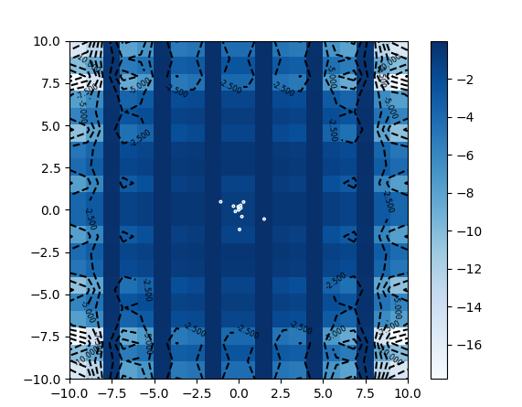

# python-pso

Implementations of the Particle Swarm Optimizer (PSO). This set of algorithms aims to mimic a swarm of particles. It can also be thought of as a swarm of animals. Each particle evaluates a given function and moves with respect to the global and personal minimum/maximum. Thus, this algorithm behaves similar to genetic algorithms. An illustration of one evaluation step in an 2D example which can be produced while running the algorithm is shown below.



## Getting Started

Depending on your capabilities and interests you have different options from here:

+ Read some [papers](#Relevant-literature) and dive into the concepts of PSO and H-PSO.
+ Skim over the summaries of [PSO](#PSO) or/ and  [H-PSO](#H-PSO) and have a look at the implementations. Feel free to comment ;)
+ Navigate to the [PSO tutorial](pso/pso.ipynb). I prepared a Jupyter Notebook to illustrate a simple and more efficient version of the algorithm. You should be rather familiar with numpy to understand the code.

## Prerequisites

```
pip install numpy
pip install matplotlib
```


## PSO

This is a common implementation of the PSO, only with some
extensions. Meaning the algorithm runs a set number of iterations or
if the sd of the swarm is less than a predefined value (this is relatively
arbitrary, in this case the square root of the product(n * dims),
which seemed to be a reasonable idea).

Every iteration consists mainly of two steps: 

- evaluation the field at a given place for every particle 
- and updating it's position according to their personal best solution and the best solution
found in the swarm. 

Every particle has a position in space and a vector defining it's velocity. As indicated, if a solution is better, it's updated. In this implementation you can set the relative time, when to start taking into account the global best solution. This can be done to give personal best  solutions a greater impact to not miss global minima. For more complex problems you should
consider using H-PSO or even PH-HPSO. Some more things I changed about the original
algorithm:

 - if the velocity is to low, speed up with a rand_speed_factor, correlating with the
 dimension of the problem.
 - don't exceed a maximum speed.
 - chaos for velocity
 - limit the search space to the given problem (-n,n)
 
Some of them could be left out or extended or could be set in motion in a more elegant way. Some of the characteristics, e.g. the sum(dev) of the swarm I found in the paper or the script for swarm intelligence, others were found in an try-and-error way. I just want to illustrate the main principles for myself and everybody interested.

The visualisation objects have to be initialized in a main method and passed as
arguments. For more information about the classes look at 'my_visualisation.py'


## H-PSO

This is a basic implementation of the H-PSO-Algorithm. It's derived from PSO and has a tree-object. I figure this can be done way more elegantly, but then again, it's just for illustration. Most of the main-functions are called in recursive fashion. Since the tree-height shouldn't exceed 2 or max 3 levels, this can be implemented otherwise (not recursive).

The particles are hold in a tree-structure: the particle with the global best solution should be in the root, local best solutions are kept in the lower levels and leafs (although they are just 'normal' particles). Every parent has a direct impact on it's child. First every particle checks it's current solution and updates it's personal best if it's better. Then the particles swapp their places. This is done in the following way: if the solution of a child is better (i.e. lower) than it's parent, they change places. This is done top-bottom.

After, the particles change their position and speed according to their local and personal best solution. The weight changes with the level of the particle, ^HPSO and vHPSO are possible: vHPSO meaning the weight decreases towards the root. Unlike the PSO, I only added one addition, namely to stop if the diversity of the swarm is below a tolerance.

So far there is no implementation of PH-PSO. A first try can be found in update_hpso.
The visualisation is done like in the PSO class.


### Relevant literature
 
- James Kennedy and Russell Eberhart. Particle swarm optimization. In IEEE International Conference on Neural Networks (ICNN’95), volume 4, pages 1942–1947, Perth, Western Australia, November-December 1995. IEEE.

- Trelea. The particle swarm optimization algorithm: Convergence analysis and parameter selection. IPL: Information Processing Letters, 85, 2003.

- J. Kennedy and R. Mendes. Population structure and particle swarm performance. In David B. Fogel, Mohamed A. El-Sharkawi, Xin Yao, Garry Greenwood, Hitoshi Iba, Paul Marrow, and Mark Shackleton, ed- itors, Proceedings of the 2002 Congress on Evolutionary Computation CEC2002, pages 1671–1676. IEEE Press, 2002. ISBN 0-7803-7278-6.
- P. N. Suganthan. Particle swarm optimizer with neighborhood opera- tor. In 1999 Congress on Evolutionary Computation, pages 1958–1962, Piscataway, NJ, 1999. IEEE Service Center.
Trelea.
